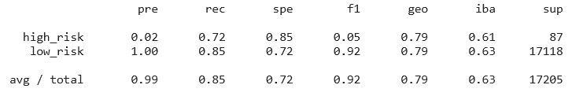
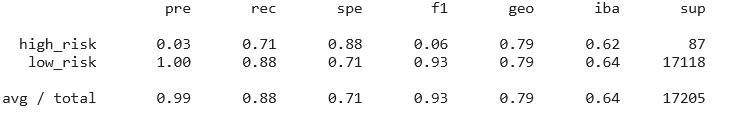
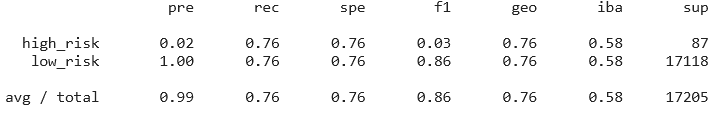
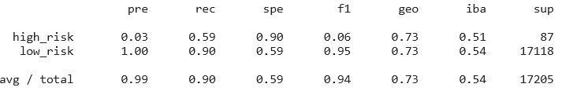
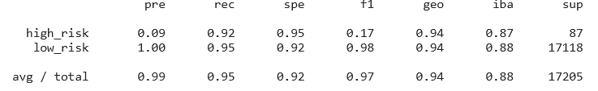

# Machine Learning (Classification) Homework

## Background

This project aims to build and evaluate several machine-learning models to predict credit risk using free data from LendingClub. The files include:

[Resampling Notebook](credit_risk_resampling.ipynb)

[Ensemble Notebook](credit_risk_ensemble.ipynb)

[Lending Club Loans Data](Resources/LoanStats_2019Q1.csv.zip)

- - -

## Summary of Analysis

#### Resampling

The following algorithms were used to resample the LendingClub data and build and evaluate logistic regression classifiers using the resampled data.

1. Oversample the data using the `Naive Random Oversampler` algorithm

2. Oversample the data using the `SMOTE` algorithm

3. Undersample the data using the `Cluster Centroids` algorithm

4. Over- and under-sample using a combination `SMOTEENN` algorithm.

In summary, using the SMOTEENN algorithm (combination over- and under-sampling algorithm) resulted in the best balanced accuracy score of 0.797195732662936. Using the Cluster Centroids algorithm (under-sampling algorithm) resulted in the best recall score (0.76) to predict high-risk loans. Using the Naive Random Oversampler and SMOTE algorithms (over-sampling algorithm) and using the SMOTEENN algorithm (combination over- and under-sampling algorithm) all produced the best geometric mean score of 0.79.

#### Ensemble Learning

Two different ensemble classifiers were used to to predict loan risk

1. Balanced Random Forest Classifier

2. Easy Ensemble Classifier

In summary, Using the Easy Ensemble Classifier algorithm resulted in the best balanced accuracy score of 0.9369578705214515. Using the Easy Ensemble Classifier algorithm resulted in the best recall score (0.92) to predict high-risk loans. Using the Easy Ensemble Classifier algorithm resulted in the best geometric mean score (0.94).

The top three features for the Balanced Random Forest Classifier algorithm are: total_rec_prncp (0.08010597363636172), total_rec_int (0.06982507547816391), total_rec_int (0.0671662999611361).